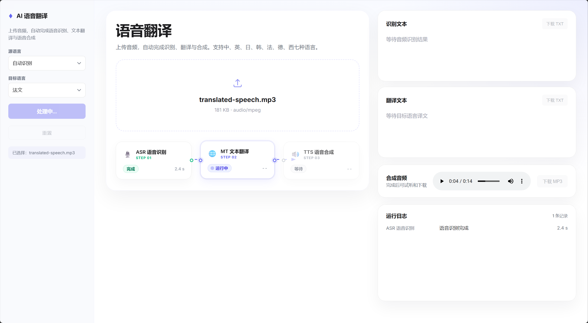
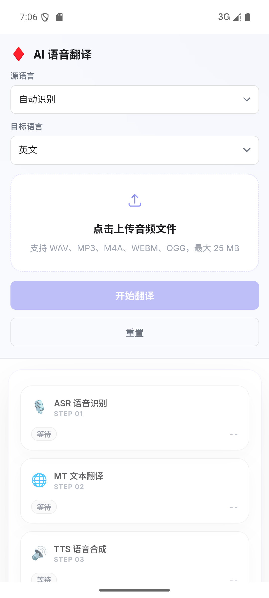

# AI 语音翻译流水线

一个面向 AI Coding 笔试演示的端到端语音翻译应用，已提供 Web 端和 Android App。用户上传音频后，应用会依次完成 ASR 语音识别、MT 文本翻译、TTS 语音合成，并输出日志、耗时、识别文本、译文文件和合成音频。

## 项目简介

本项目对应题目“构建语音翻译流水线”，使用 React + Capacitor 实现 Web 和 Android 双端交互，并通过 NestJS 本地后端代理调用 AI 服务。Android App 复用核心交互逻辑，同时针对移动端补充了原生文件下载能力。用户上传本地音频后，系统依次完成：

1. ASR：音频转文本
2. MT：源语言到目标语言翻译
3. TTS：目标语言语音合成
4. 结果展示与导出：日志、耗时、识别文本、译文文本、合成音频

## 界面预览

<p>
  
</p>

### Android App 预览

<p>
  
</p>

## 题目要求对照

1. 导入本地音频文件
   已实现。前端支持上传 WAV、MP3、M4A、WEBM、OGG，最大 25 MB。
2. 调用 ASR 服务识别并显示文本
   已实现。后端调用 OpenAI `gpt-4o-mini-transcribe`，前端展示识别文本。
3. 调用 MT 接口翻译并显示结果
   已实现。后端调用 OpenAI `gpt-5-mini`，前端展示译文。
4. 调用 TTS 服务合成目标语言音频并保存到本地
   已实现。后端调用 OpenAI `gpt-4o-mini-tts`，前端支持下载 `translated-speech.mp3`。
5. 输出运行日志和产物文件
   已实现。前端展示阶段日志与耗时，支持下载 `transcript.txt`、`translation.txt` 和合成音频。Android App 会将产物保存到系统 `Downloads` 目录。

## 加分项完成情况

1. 支持指定源语言和目标语言
   已实现，前端可选择 `sourceLanguage` 和 `targetLanguage`。
2. 对每个阶段耗时进行统计并打印
   已实现，返回并展示 ASR、翻译、TTS 及总耗时。
3. 任一步骤失败时给出清晰错误提示
   已实现，后端返回结构化错误，前端展示错误信息和阶段日志。

## 技术栈

- 前端：Vite + React + TypeScript，使用 `useReducer` 管理单页流水线状态。
- 移动端：Capacitor Android，复用 React 前端并封装为 Android App；通过原生 `MediaStore` 插件将导出文件保存到系统 `Downloads` 目录。
- 后端：NestJS 本地 API 代理，使用 `FileInterceptor` 接收音频文件。
- AI 服务：OpenAI Audio Transcriptions、Responses API、Audio Speech。

## 环境准备

```powershell
pwsh.exe -NoLogo -NoProfile
npm install
npm --prefix frontend install
npm --prefix backend install
Copy-Item backend/.env.example backend/.env
```

然后在 `backend/.env` 中填入：

```text
OPENAI_API_KEY=你的 OpenAI API Key
PORT=3001
HOST=0.0.0.0
```

`HOST=0.0.0.0` 用于 Android 真机或模拟器通过局域网访问本机后端。只运行 Web 端时也可以保留该配置。

## 运行

```powershell
npm run dev
```

- 前端默认地址：`http://localhost:5173`
- 后端默认地址：`http://localhost:3001/api`

## Android App 运行

Android App 使用 Capacitor 封装 `frontend`，核心页面和 Web 端保持一致，API 调用复用 `backend`。模拟器构建会自动注入 `http://10.0.2.2:3001/api`，避免与 Web 端的 `/api` 代理配置混用。

先启动后端：

```powershell
pwsh.exe -NoLogo -NoProfile
npm --prefix backend install
npm --prefix backend run dev
```

使用 Android 模拟器开发时，在项目根目录执行：

```powershell
npm run android
```

该命令会依次完成前端构建、Capacitor Android 同步，并打开 Android Studio。之后在 Android Studio 中启动模拟器并运行 `app`。

也可以直接从命令行构建、同步、部署并启动 App：

```powershell
npm run android:run
```

开发真机 App 时，需要让构建包使用手机可访问的局域网地址：

真机示例：

```powershell
pwsh.exe -NoLogo -NoProfile
$env:VITE_API_BASE_URL='http://你的电脑局域网IP:3001/api'
npm --prefix frontend run build
cd frontend
npx cap sync android
npx cap open android
```

如果使用真机，请确保手机和电脑在同一局域网，并且防火墙允许访问 `3001` 端口。Android 工程已开启开发期 HTTP 明文请求，正式部署时建议改为 HTTPS。

## 使用流程

1. 上传 WAV、MP3、M4A、WEBM 或 OGG 音频，最大 25 MB。
2. 选择源语言和目标语言。
3. 点击“运行流水线”。
4. 查看识别文本、翻译文本、合成音频、阶段耗时和运行日志。
5. 下载 `transcript.txt`、`translation.txt` 和 `translated-speech.mp3`。Android App 会将文件保存到系统 `Downloads` 目录。

## 验证

```powershell
npm run build
npm run lint
npm --prefix frontend run test
npm --prefix backend run test
```

## 配置说明

- API Key 只在 `backend/.env` 中使用，不会进入前端包。
- Web 开发环境使用 Vite `/api` 代理访问本机后端；Android 模拟器构建使用 `http://10.0.2.2:3001/api` 访问宿主机后端。
- 后端默认模型：
  - ASR：`gpt-4o-mini-transcribe`
  - 翻译：`gpt-5-mini`
  - TTS：`gpt-4o-mini-tts`
- 当前版本不包含数据库、历史记录、任务队列或账号系统，重点是清晰展示一次完整的语音翻译流水线。

## 工程说明

- 前端使用 React + TypeScript，状态集中在 `usePipeline` 中管理。
- Android App 使用 Capacitor 封装，并注册原生下载插件写入系统公共下载目录。
- 后端使用 NestJS，并已拆分为 `openai`、`asr`、`translation`、`tts` 和 `pipeline` 编排模块。
- `pipeline` 对外保留统一接口，内部按能力解耦，便于扩展其他阶段或替换底层服务。
